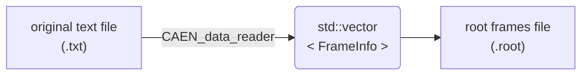
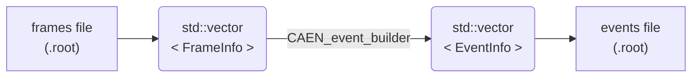

# SJ's CAEN data analysis project

Shihai J.
Niels Bohr Institute, University of Copenhagen

## Typical workflow

### a. Read data from original text file and write to root frames file



```cpp
CAEN_data_reader *reader = new CAEN_data_reader("path_to_original_text_file.txt");
reader->extract_frame_info_array(INFINITE_FRAMES, true);
reader->write_frame_array2root_file();
delete reader;
```

### b. Open a root frames file and use event builder to reconstruct events



```cpp
CAEN_data_reader    *reader  = new CAEN_data_reader();
CAEN_event_builder  *builder = new CAEN_event_builder();
reader ->read_root_file2frame_array("path_to_root_frames_file.root");
builder->reconstruct_event(reader->get_frame_info_array_ptr(), INFINITE_FRAMES);
builder->write_event_array2root_file("path_to_root_events_file.root");
delete builder;
delete reader;
```