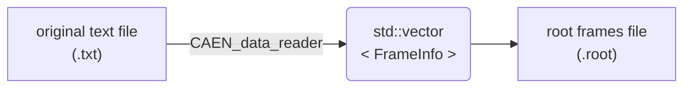
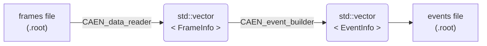
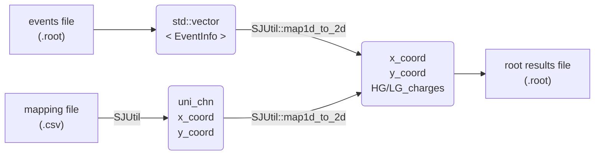

# SJ's CAEN data analysis project

Shihai J.
Niels Bohr Institute, University of Copenhagen

- [SJ's CAEN data analysis project](#sjs-caen-data-analysis-project)
  - [Typical workflow](#typical-workflow)
    - [a. Read data from original text file and write to root frames file](#a-read-data-from-original-text-file-and-write-to-root-frames-file)
    - [b. Open a root frames file and use event builder to reconstruct events](#b-open-a-root-frames-file-and-use-event-builder-to-reconstruct-events)
    - [c. Read a mapping file](#c-read-a-mapping-file)
    - [d. Read a mapping file and generate x,y coordinates](#d-read-a-mapping-file-and-generate-xy-coordinates)
    - [e. Read reconstructed events and get channel locations based on the mapping file](#e-read-reconstructed-events-and-get-channel-locations-based-on-the-mapping-file)


## Typical workflow

### a. Read data from original text file and write to root frames file



```cpp
CAEN_data_reader *reader = new CAEN_data_reader(file_CAEN_path);
reader->extract_frame_info_array(INFINITE_FRAMES, true);
reader->write_frame_array2root_file(file_root_frames_path);
delete reader;
```

### b. Open a root frames file and use event builder to reconstruct events



```cpp
auto reader  = new CAEN_data_reader();
auto builder = new CAEN_event_builder();
reader ->read_root_file2frame_array(file_root_frames_path);
builder->reconstruct_event(reader->get_frame_info_array_ptr(), INFINITE_FRAMES);
builder->write_event_array2root_file(file_root_events_path);
delete builder;
delete reader;
```

### c. Read a mapping file 

```cpp
auto mapping = SJUtil::read_mapping_csv_file("path_to_mapping.csv");

auto Mapping_Board_Num_Array    = mapping[0];
auto Mapping_Channel_Num_Array  = mapping[1];
auto Mapping_Module_Num_Array   = mapping[2];
auto Mapping_Col_Array          = mapping[3];
auto Mapping_Row_Array          = mapping[4];
```

### d. Read a mapping file and generate x,y coordinates

```cpp
auto mapping = SJUtil::read_mapping_csv_file("path_to_mapping.csv");
auto mapping_coords = SJUtil::generate_mapping_croodinate(mapping);

auto uni_chn = mapping_coords[0];
auto x_coord = mapping_coords[1];
auto y_coord = mapping_coords[2];
```

### e. Read reconstructed events and get channel locations based on the mapping file



```cpp
auto mapping        = SJUtil::read_mapping_csv_file(file_mapping_path);
auto mapping_coords = SJUtil::generate_mapping_croodinate(mapping);

auto builder = new CAEN_event_builder();
builder->read_root_file2event_array(file_root_events_path);

auto eventArrayPtr  = builder->get_event_array_ptr();
auto eventValidPtr  = builder->get_event_valid_array_ptr();
auto eventNum       = int(eventValidPtr->size() / 100);

TFile *f = new TFile(file_root_results_path, "RECREATE");

for (auto i = 0; i < eventNum; i++){
    if (!eventValidPtr->at(i)) continue;
    auto HG_charges     = eventArrayPtr->at(i).HG_charges;
    auto twoD_values    = SJUtil::map1d_to_2d(HG_charges, mapping_coords);

    char *name = new char[20];
    snprintf(name, 20, "event_%d", i);
    TCanvas *c1 = new TCanvas(name, "3D scatter", 2500, 2000);
    TGraph2D *gr = new TGraph2D();

    gr->SetMarkerStyle(20);
    gr->SetMarkerSize(2);
    gr->SetMarkerColor(kRed);

    for (auto j = 0; j < twoD_values[0].size(); j++){
        if (twoD_values[2][j] == INVALID_2D_VALUE) continue;
        gr->SetPoint(j, twoD_values[0][j], twoD_values[1][j], twoD_value[2][j]);
    }

    gr->GetXaxis()->SetRangeUser(0, 105);
    gr->GetYaxis()->SetRangeUser(0, 105);
    gr->GetZaxis()->SetRangeUser(0, 1000);
    gr->Draw("pcol");
    c1->Update();
    c1->WaitPrimitive();
    c1->Write();
    delete c1;
    delete gr;
}
f->Close();
delete builder;
```