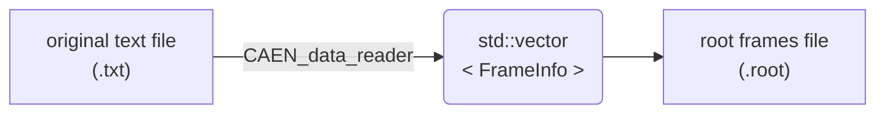
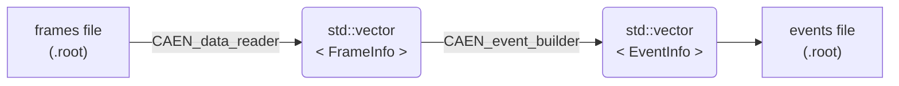
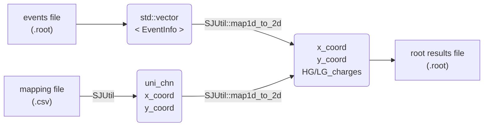

# SJ's CAEN data analysis project

Shihai J.
Niels Bohr Institute, University of Copenhagen

- [SJ's CAEN data analysis project](#sjs-caen-data-analysis-project)
  - [Typical workflow](#typical-workflow)
    - [a. Read data from original text file and write to root frames file](#a-read-data-from-original-text-file-and-write-to-root-frames-file)
    - [b. Open a root frames file and use event builder to reconstruct events](#b-open-a-root-frames-file-and-use-event-builder-to-reconstruct-events)
    - [c. Read a mapping file](#c-read-a-mapping-file)
    - [d. Read a mapping file and generate x,y coordinates](#d-read-a-mapping-file-and-generate-xy-coordinates)
    - [e. Read reconstructed events and get channel locations based on the mapping file](#e-read-reconstructed-events-and-get-channel-locations-based-on-the-mapping-file)
    - [f. Generate accumulated charge map](#f-generate-accumulated-charge-map)
  - [3-D reconstruction](#3-d-reconstruction)
    - [a. Standard reconstruction](#a-standard-reconstruction)


## Typical workflow


### a. Read data from original text file and write to root frames file



```cpp
CAEN_data_reader *reader = new CAEN_data_reader(file_CAEN_path);
reader->extract_frame_info_array(INFINITE_FRAMES, true);
reader->write_frame_array2root_file(file_root_frames_path);
delete reader;
```

### b. Open a root frames file and use event builder to reconstruct events



```cpp
// * Other info generation
auto mapping        = SJUtil::read_mapping_csv_file(file_mapping_path);
auto mapping_coords = SJUtil::generate_mapping_croodinate(mapping);
auto pedestalInfo   = SJUtil::read_pedestal_csv_file(file_pedestal_path);
// * Main program

auto reader  = new CAEN_data_reader();
auto builder = new CAEN_event_builder();
reader ->read_root_file2frame_array(file_root_frames_path);
builder->set_pedestal_info(pedestalInfo);
builder->reconstruct_event(reader->get_frame_info_array_ptr (),INFINITE_FRAMES, true);
builder->write_event_array2root_file(file_root_events_path);
delete builder;
delete reader;
```

### c. Read a mapping file 

```cpp
auto mapping = SJUtil::read_mapping_csv_file("path_to_mapping.csv");

auto Mapping_Board_Num_Array    = mapping[0];
auto Mapping_Channel_Num_Array  = mapping[1];
auto Mapping_Module_Num_Array   = mapping[2];
auto Mapping_Col_Array          = mapping[3];
auto Mapping_Row_Array          = mapping[4];
```

### d. Read a mapping file and generate x,y coordinates

```cpp
auto mapping = SJUtil::read_mapping_csv_file("path_to_mapping.csv");
auto mapping_coords = SJUtil::generate_mapping_croodinate(mapping);

auto uni_chn = mapping_coords[0];
auto x_coord = mapping_coords[1];
auto y_coord = mapping_coords[2];
```

### e. Read reconstructed events and get channel locations based on the mapping file



```cpp
auto mapping        = SJUtil::read_mapping_csv_file(file_mapping_path);
auto mapping_coords = SJUtil::generate_mapping_croodinate(mapping);
auto builder = new CAEN_event_builder();
builder->read_root_file2event_array(file_root_events_path);

auto eventArrayPtr  = builder->get_event_array_ptr();
auto eventValidPtr  = builder->get_event_valid_array_ptr();
auto eventNum       = int(eventValidPtr->size() / 100);
TFile *f = new TFile(file_root_results_path, "RECREATE");

for (auto i = 0; i < eventNum; i++){
    if (!eventValidPtr->at(i)) continue;
    auto HG_charges     = eventArrayPtr->at(i).LG_charges;
    auto _currentName   = Form("event_%d", i);
    auto _currentTitle  = Form("Event %d", i);
    auto Canvas_Ptr     = new TCanvas(_currentName, _currentTitle, 200,10, 700, 500);
    auto Graph_Ptr      = SJPlot::scatter_3d(HG_charges, mapping_coords,_currentName, _currentTitle);
    Canvas_Ptr->Update();
    Canvas_Ptr->WaitPrimitive();
    Canvas_Ptr->Write();
    delete Graph_Ptr;
    delete Canvas_Ptr;
}
f->Close();
delete builder;
```

### f. Generate accumulated charge map

```cpp
// * Main program
auto mapping        = SJUtil::read_mapping_csv_file(file_mapping_path);
auto mapping_coords = SJUtil::generate_mapping_croodinate(mapping);

auto builder = new CAEN_event_builder();
builder->read_root_file2event_array(file_root_events_path);

auto eventArrayPtr  = builder->get_event_array_ptr();
auto eventValidPtr  = builder->get_event_valid_array_ptr();
auto eventNum       = int(eventValidPtr->size() / 100);

TFile *f = new TFile(file_root_results_path, "RECREATE");

// * Get HGain data
std::vector<std::vector<Short_t>> HGain_data;
for (int i = 0; i < eventNum; i++)
    if (eventValidPtr->at(i))
        HGain_data.push_back(eventArrayPtr->at(i).LG_charges);

// * Generate 2-D distribution
auto Canvas_Ptr = new TCanvas("Canvas", "Canvas", 800, 600);
auto hist2D = SJPlot::distribution_2d(HGain_data, "hgain", "HGain_2D");
hist2D->Draw("colz");
gStyle->SetPalette(103);

std::vector<TLine*> LinePtrArray;

LinePtrArray.push_back(
    SJPlot::add_horizontal_line(35, 0, 105, kWhite, 2, 1));
LinePtrArray.push_back(
    SJPlot::add_horizontal_line(70, 0, 105, kWhite, 2, 1));
LinePtrArray.push_back(
    SJPlot::add_vertical_line(35, 0, 105, kWhite, 2, 1));
LinePtrArray.push_back(
    SJPlot::add_vertical_line(70, 0, 105, kWhite, 2, 1));

Canvas_Ptr->Write();

f->Close();

for (auto i=0; i<4; i++)
    delete LinePtrArray.at(i);

delete Canvas_Ptr;
delete builder;
```

## 3-D reconstruction

### a. Standard reconstruction

```cpp
auto mapping        = SJUtil::read_mapping_csv_file(file_mapping_path);
auto mapping_coords = SJUtil::generate_mapping_croodinate(mapping);
auto pedestalInfo   = SJUtil::read_pedestal_csv_file(file_pedestal_path);
auto builder        = new CAEN_event_builder();
builder->read_root_file2event_array(file_root_events_path);
auto eventArrayPtr  = builder->get_event_array_ptr();
auto eventValidPtr  = builder->get_event_valid_array_ptr();
auto eventNum       = int(eventArrayPtr->size()/10000);
TFile *f            = new TFile(file_root_results_path, "RECREATE");
for (auto i = 0; i < eventNum; i++){
    if (!eventValidPtr->at(i)) continue;
    auto HG_charges     = eventArrayPtr->at(i).HG_charges;
    auto LG_charges     = eventArrayPtr->at(i).LG_charges;
    auto _currentName   = Form("event_%d", i);
    auto _currentTitle  = Form("Event %d", i);
    auto Canvas_Ptr     = new TCanvas(_currentName, _currentTitle, 200,10,  700, 500);
    auto Graph_Ptr      = SJPlot::scatter_3d(HG_charges, mapping_coords,    _currentName,_currentTitle);
    // ! Guassian fit code here
    auto _twoD_values = SJUtil::map1d_to_2d(HG_charges, mapping_coords);
    TF2 *gaussianFunc = new TF2("gaussianFunc", SJFunc::gaussian2D, 0, 105, 0, 105, 6);
    gaussianFunc->SetParameters(50, 50, 10, 10, 0, 3000);
    gaussianFunc->SetParNames("x_{mean}", "y_{mean}", "#sigma_{x}", "#sigma_{y}", "padastal","N");
    gaussianFunc->SetLineColor(kRed);
    gaussianFunc->SetLineWidth(2);
    gaussianFunc->SetFillColorAlpha(kBlue, 0.3);
    Graph_Ptr->Fit(gaussianFunc, "R");
    Canvas_Ptr->cd();
    Graph_Ptr->Draw("pcolz");
    gaussianFunc->Draw("surf3 same");
    // gaussianFunc->Draw("cont1 same");
    Canvas_Ptr->Update();
    Canvas_Ptr->WaitPrimitive();
    Canvas_Ptr->Write();
    delete Graph_Ptr;
    delete Canvas_Ptr;
}
f->Close();
delete builder;
```
